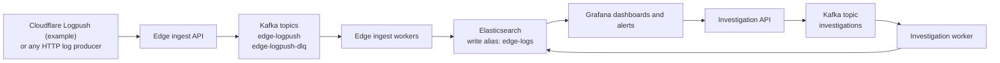

# Production-Shaped GKE SOC Stack

Guide-first reference implementation for a production-shaped SOC stack on GKE, using Cloudflare Logpush as the example HTTP producer and pairing it with Kafka-backed ingest, Elasticsearch hot/warm storage, Grafana alerting, and investigation workflows.

This repo is useful in two ways:
- as a guide for engineers designing a real ingest and investigation platform on Kubernetes
- as a reproducible deployment blueprint for the same platform shape

## What This Stack Does
- accepts batched HTTP log pushes through a stateless ingest API
- durably buffers ingestion through Kafka before indexing
- writes to Elasticsearch through versioned ILM, index-template, and alias contracts
- exposes Grafana dashboards, alerts, contact points, and notification policies
- runs investigation APIs and workers that turn alerts into deterministic triage jobs
- keeps runtime objects under version control so deployments behave consistently

## Why This Repo Is Worth Studying
- **Cloudflare example, reusable pattern:** the producer example is Cloudflare Logpush, but the same design works for any HTTP log producer
- **Durable ACK boundary:** the ingest API can acknowledge after Kafka durability instead of waiting on Elasticsearch indexing
- **Separation of concerns:** API and worker roles scale independently and fail differently
- **Operational realism:** hot/warm storage, Kafka lag, write bottlenecks, alert routing, and investigation playbooks are treated as first-class concerns
- **Versioned runtime behavior:** Kafka topics, Elasticsearch objects, and Grafana assets are part of the repo, not tribal knowledge

## Architecture At A Glance

## Start Here
1. Read `docs/architecture.md` for the platform model and design tradeoffs.
2. Read `docs/workflows.md` for the ingest and investigation flows.
3. Read `docs/lessons.md` for the operational lessons embedded in the stack.
4. Use `docs/getting-started.md` to deploy it.
5. Use `docs/getting-started.md` to deploy the stack end to end.

## Repo Map
- `infra/gcp`: Terraform for the GKE and network foundation
- `k8s`: namespace-scoped Kubernetes manifests and platform values
- `runtime`: Kafka, Elasticsearch, and Grafana runtime objects
- `services/edge-ingest`: source for the ingest API and worker image
- `services/investigation-ops`: source for the investigation API and worker image
- `docs`: guide material and deployment docs
- `scripts`: bootstrap, render, and smoke-test tooling

## Deployment Path
The primary supported path is the production-shaped GKE deployment documented in `docs/getting-started.md`.

High-level flow:
1. Copy `.env.example` to `.env` and fill the required values.
2. Provision infra with Terraform.
3. Install the platform layer.
4. Render secrets and apply apps.
5. Bootstrap runtime objects.
6. Run smoke validation.

### Adaptation path
If you are using this as a reference rather than reproducing the same shape:
- keep the split ingest pattern
- keep Kafka topic contracts and DLQ separation
- keep Elasticsearch runtime objects versioned
- adapt node sizes, retention windows, and public exposure to your environment

## Guide Track
- `docs/architecture.md`
- `docs/workflows.md`
- `docs/lessons.md`
- `docs/getting-started.md`
- `docs/scope.md`

## Core Contracts
- HTTP ingest endpoint:
  - `POST /`
  - `GET /healthz`
- Kafka topics:
  - `edge-logpush`
  - `edge-logpush-dlq`
  - `investigations`
- Elasticsearch aliases and indices:
  - `edge-logs`
  - `investigation-results-v1`
- Grafana assets:
  - dashboards
  - alert rules
  - contact points
  - notification policies

## What You Can Use This Repo For
- study a production-shaped ingest and investigation platform on GKE
- deploy the stack as a working reference implementation
- adapt a Cloudflare Logpush-style ingest path to your own producers
- reuse Kafka, Elasticsearch, and Grafana runtime contracts in your own environment
- reuse the playbook-driven investigation flow with your own alerts and identifiers

## Notes
- The active ingest path is the split deployment under `k8s/namespaces/observability/`:
  - `edge-ingest-api`
  - `edge-ingest-worker`
  - `edge-ingest` LoadBalancer service targeting the API
