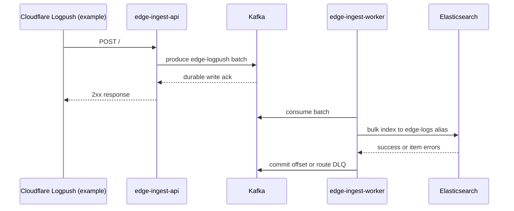
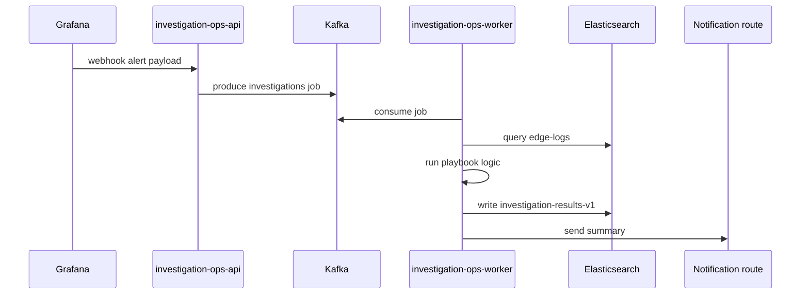

# Workflows

## Ingest Workflow

### What to watch
- API success rate
- producer errors
- Kafka lag
- worker error rate
- Elasticsearch write queue and rejections
- freshness of indexed events

## Investigation Workflow

### What to watch
- webhook acceptance rate
- job backlog on `investigations`
- Elasticsearch query latency for playbooks
- investigation result indexing success
- notification failures

## Deployment Sequencing
The sequencing rule is:
1. infra
2. platform
3. apps
4. runtime bootstrap
5. smoke validation

Do not invert that order. The services depend on runtime objects and secrets that do not exist after the infra layer alone.

## Operational Failure Modes
### Kafka lag grows while API stays healthy
This usually means the system is accepting traffic but search indexing throughput is behind current ingress. Check:
- consumer throughput
- Elasticsearch hot-tier write pressure
- current write index shard layout
- worker concurrency and batch settings

### Elasticsearch is green but data is late
This usually means the search cluster is healthy enough to write, but it is consuming backlog rather than fresh traffic. Check:
- Kafka lag
- event time versus ingest time in dashboards
- current write index freshness

### Investigation jobs are accepted but no results appear
Check:
- `investigations` topic depth
- worker logs
- playbook selection rules
- Elasticsearch permissions and target index lifecycle
