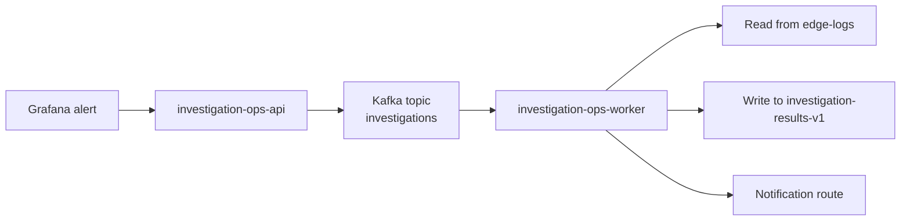

# Investigation Ops Service

Python service for Grafana-driven investigation workflows.

It adds a webhook intake and worker flow beside the ingest pipeline so alerts can become deterministic jobs instead of ad hoc manual triage.

## What It Does
1. Receives Grafana webhooks at `POST /webhooks/grafana`
2. Validates and normalizes the alert payload
3. Publishes investigation jobs to Kafka topic `investigations`
4. Runs YAML playbooks against Elasticsearch data in `edge-logs`
5. Writes results to `investigation-results-v1`
6. Optionally sends notification summaries

## Why This Service Exists
A dashboard alert is usually not enough to explain what happened. This service makes investigations repeatable by separating:
- webhook intake
- job transport
- playbook logic
- result persistence
- notification formatting

## Architecture


## Playbooks
Current playbooks include:
- `request_volume_anomaly`
- `availability_drop_triage`
- `source_entity_concentration`
- `identity_rotation_anomaly`
- `session_reuse_anomaly`
- `scoped_route_anomaly`
- `generic_alert_triage`

The important design choice is that the playbooks stay data-driven and isolated from the transport layer.

## Project Structure
```text
app/
  api/
  core/
  feature_extraction/
  integrations/
  models/
  playbooks/
  scoring/
  services/
  worker/
config/
  playbooks/
examples/
ops/
  elastic/
  grafana/
  k8s/
tests/
```

## Required Environment Variables
- `WEBHOOK_SHARED_TOKEN`
- `KAFKA_BOOTSTRAP_SERVERS`
- `INVESTIGATION_JOB_TOPIC`
- `ELASTICSEARCH_URL`
- `ELASTICSEARCH_INDEX_ALIAS`
- `ELASTICSEARCH_USERNAME`
- `ELASTICSEARCH_PASSWORD`
- `RESULT_INDEX`

Useful optional variables:
- `SLACK_WEBHOOK_URL`
- `ELASTICSEARCH_CA_CERT_PATH`
- `PLAYBOOK_DIR`
- `FIELD_MAPPING_OVERRIDES_PATH`

## Local Run
```bash
python3 -m venv .venv
source .venv/bin/activate
pip install -e .[dev]
```

Run the API:
```bash
export WEBHOOK_SHARED_TOKEN=replace-me
export KAFKA_BOOTSTRAP_SERVERS=localhost:9092
python -m app.api.main
```

Run the worker:
```bash
export ELASTICSEARCH_URL=http://localhost:9200
export ELASTICSEARCH_INDEX_ALIAS=edge-logs
export RESULT_INDEX=investigation-results-v1
python -m app.worker.main
```

Run tests:
```bash
pytest
```

## Docker
Build:
```bash
docker build -t investigation-ops:local .
```

Run API:
```bash
docker run --rm -p 8080:8080 \
  -e WEBHOOK_SHARED_TOKEN=replace-me \
  -e KAFKA_BOOTSTRAP_SERVERS=host.docker.internal:9092 \
  investigation-ops:local
```

Run worker:
```bash
docker run --rm -p 8081:8080 \
  -e ELASTICSEARCH_URL=http://host.docker.internal:9200 \
  -e ELASTICSEARCH_INDEX_ALIAS=edge-logs \
  -e RESULT_INDEX=investigation-results-v1 \
  investigation-ops:local \
  python -m app.worker.main
```

## Kubernetes Rollout
1. Build and push the image to `ghcr.io/example/gke-soc-observability-stack/investigation-ops:<tag>`.
2. Create `investigation-ops-secret` from `ops/k8s/secret.example.yaml`.
3. Copy the Elasticsearch HTTP CA into the target namespace:

```bash
kubectl get secret search-stack-es-http-ca-internal -n observability -o json \
  | jq 'del(.metadata.uid,.metadata.resourceVersion,.metadata.creationTimestamp,.metadata.ownerReferences,.metadata.annotations."kubectl.kubernetes.io/last-applied-configuration") | .metadata.namespace="investigations" | .metadata.name="investigation-search-ca"' \
  | kubectl apply -f -
```

4. Confirm the Kafka topic `investigations` exists.
5. Apply the namespace and workload manifests:

```bash
kubectl apply -k ops/k8s
```

6. In Grafana, create or update a webhook contact point to:

```text
http://investigation-ops-api.investigations.svc.cluster.local:8080/webhooks/grafana
```

Use a Bearer token header that matches `WEBHOOK_SHARED_TOKEN`.

7. Apply the supporting runtime objects as needed:
- Elasticsearch ILM policy: `ops/elastic/investigation-results-ilm-policy.json`
- Elasticsearch index template: `ops/elastic/investigation-results-index-template.json`
- Grafana result datasource: `ops/grafana/investigation-results-datasource.json`

## Example Contracts
- Grafana webhook: `examples/grafana_webhook_payload.json`
- Normalized Kafka message: `examples/normalized_kafka_message.json`
- Request-volume query pack: `examples/request_volume_anomaly_query_pack.json`
- Slack payload: `examples/slack_message_payload.json`

## Constraints And Notes
- Webhook ingress is internal-only in this design.
- `aiokafka` is used to keep the service fully async.
- NetworkPolicy cannot restrict Slack egress by hostname on GKE, so outbound TCP `443` is allowed broadly unless you add stronger egress controls.
- The worker mounts a copied CA secret named `investigation-search-ca` inside `investigations`; Kubernetes cannot mount a secret from `observability` directly.
